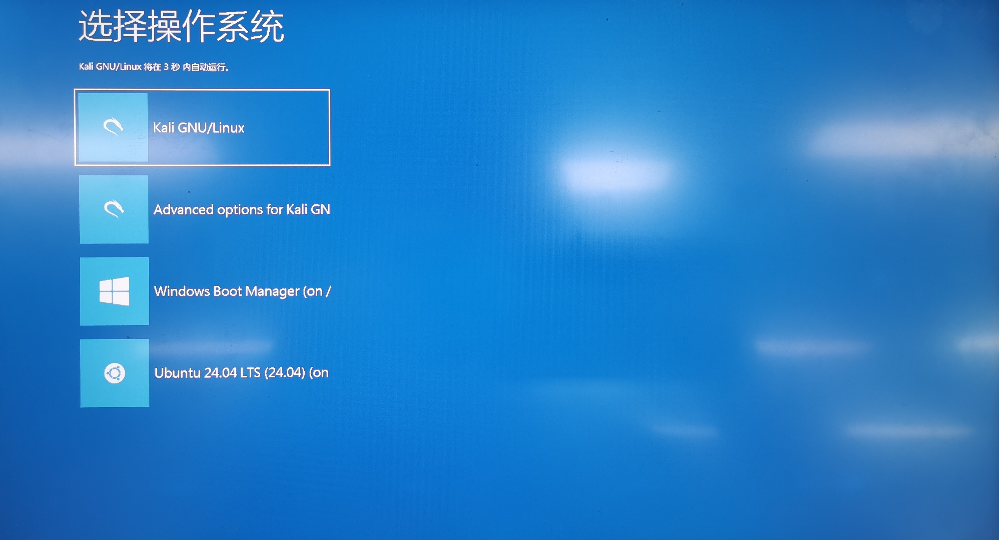
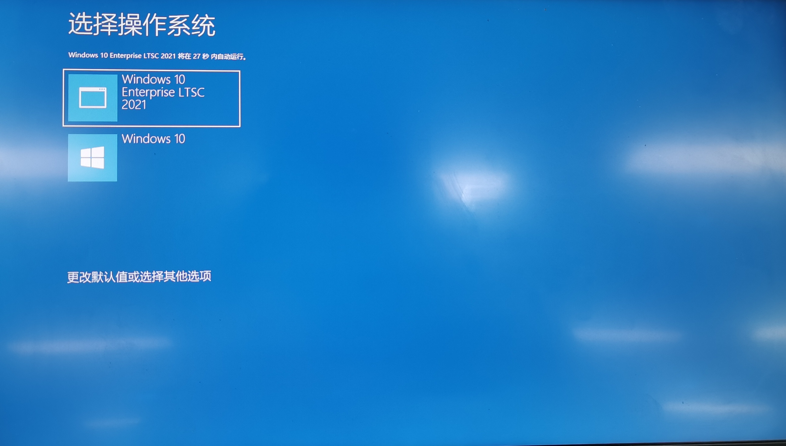

# Windows GRUB 样式

仿写了一个类似 Windows Boot Manager 的 GRUB 主题，简体中文版。

## 效果



作为对比，这是原版 Windows Boot Manager 在我的电脑中的效果



## 使用方法

首先你需要准备好你自己的 `微软雅黑` 和 `微软静黑` 字体。文件名一般是 `msyh.ttc` ，`msyhl.ttc` 和 `msjh.ttc`，这个可以从 Windows 获得，在 `C:\Windows\Fonts` 里。

### Debian 系简易安装

我提供了 deb 安装包，您需要从 release 里下载 deb 包进行安装，同时根据安装时的终端的提示完成字体配置。

该 deb 包适用于任何架构，但仅限于 Debian 系发行版。卸载该 deb 包时会打扫干净恢复原样。

### 手动安装

对于 Debian 系发行版，手动安装的方法是：

1. 下载本仓库，把本仓库 `src` 目录复制为 `/boot/grub/themes/Windows` 目录。
2. 修改 `/boot/grub/themes/Windows/theme.txt` 第 35 行为你自己的操作系统。
3. 修改 `/etc/grub.d/00_header`，在顶上添加一行

   ```bash
   GRUB_THEME=/boot/grub/themes/Windows/theme.txt
   ````

4. 修改 `/etc/grub.d/10_linux`，在含有 `gettext_printf "Advanced options for %s"` 的那一行（本人电脑是 393 行）里，`\$menuentry_id_option` 前添加一项 `${CLASS}`（前后带空格）
5. 修改 `/etc/grub.d/30_os-prober`，在含有 `gettext_printf "Advanced options for %s"` 的那一行（本人电脑是 291 行）里，`\$menuentry_id_option` 前添加一项 `${CLASS}`（前后带空格）
6. 修改 `/etc/grub.d/30_uefi-firmware`，在含有 `menuentry '$LABEL'` 的那一行（本人电脑是 37 行）里，`\$menuentry_id_option` 前添加一项 `--class efi`（前后带空格）
7. 完成字体配置

   ```bash
   sudo grub-mkfont -s 24 --range=0x20-0x7F -o /boot/grub/themes/Windows/msjh24.pf2 your/msjh.ttc
   sudo grub-mkfont -s 16 --range=0x20-0x7F,0x2191-0x2191,0x2193-0x2193,0x3002-0x3002,0x5185-0x5185,0x5207-0x5207,0x52A8-0x52A8,0x5C06-0x5C06,0x5728-0x5728,0x62E9-0x62E9,0x6309-0x6309,0x6362-0x6362,0x79D2-0x79D2,0x81EA-0x81EA,0x884C-0x884C,0x8FD0-0x8FD0,0x9009-0x9009,0x952E-0x952E,0xFF0C-0xFF0C  -o /boot/grub/themes/Windows/msyh16.pf2 your/msyh.ttc
   sudo grub-mkfont -s 64 --range=0x4F5C-0x4F5C,0x62E9-0x62E9,0x64CD-0x64CD,0x7CFB-0x7CFB,0x7EDF-0x7EDF,0x9009-0x9009 -o /boot/grub/themes/Windows/msyh64.pf2 your/msyhl.ttc
   ```

8. 执行 `update-grub`

其他发行版暂不清楚能否可以运行，但方法类似。

## 感谢

图标来自于 [https://github.com/MrVivekRajan/Grub-Themes](https://github.com/MrVivekRajan/Grub-Themes) 的二次制作。

## 免责声明

本仓库仅供学习交流使用，禁止用于商用，若使用本仓库内容请标明出处。

使用本开源仓库及其成果时，您知道可能对你的计算机产生危害，产生的一切损失由使用者承担。
